# Show me

Point it at a codebase. Get back a map you can check.

[](https://ofori01.github.io/show-me/)

### [→ Open the live demo](https://ofori01.github.io/show-me/)

That is Show me, mapped by Show me — real geometry, not a mock-up. Walk the
chapters, click a building to read what it does, watch a payload travel a real
path. The same map as text is [SYSTEM.md](SYSTEM.md).

## What it is

A skill for coding agents. It reads a repository and draws it: buildings sized
from the real source, connections traced through actual call and data paths, each
part explained in plain English — and **every claim citing a file, a line, and
the text found at that line.**

It works on any language, because nothing in it parses source code. The agent
reads; the scripts only do what reading reliably gets wrong — checking every
citation, counting lines so sizes are measured rather than guessed, and drawing a
scene whose connections provably never cross a building.

## Why that matters

Diagrams go stale, and a stale one is worse than none: people plan against it.
An AI will also happily draw a dependency that does not exist.

So before anything renders, a script opens every cited file and confirms the
quotation is really there. A map does not get to be pretty unless it is
checkable.

It catches fabrication, not misreading — a wrong reading with a real citation
still passes. That is exactly why the reading stays with the agent and is never
handed to a pattern.

## Install

```bash
git clone https://github.com/Ofori01/show-me.git
cp -R show-me/skills/show-me ~/.claude/skills/        # everywhere
# or just one project:
cp -R show-me/skills/show-me /path/to/repo/.claude/skills/
```

Then ask for what you want:

> Show me how authentication works in this repo.

Node 18 or newer. No dependencies, no build step.

## Run it on itself

The one example that ships is the map of this repo, so every citation resolves.

```bash
cd skills/show-me
node scripts/validate.mjs examples/show-me.system-map.json --repo ../..
node scripts/render.mjs   examples/show-me.system-map.json --repo ../.. --out /tmp/map.html --standalone
node scripts/twin.mjs     examples/show-me.system-map.json --repo ../.. --out /tmp/SYSTEM.md
```

Break a citation on purpose and run the gate again. That is the whole idea in one
command.

`SKILL.md` is what the agent follows; `references/` explains the data contract,
how to read a codebase, and what every shape means.

## Credit

The visual language came from a "codebase as interactive isometric diagram"
reference. [inkboard/system-atlas](https://github.com/inkboard/system-atlas) was
built from the same reference for the opposite purpose — designing a system in
conversation rather than reading one that exists. Readable name tags, the
generated text twin, and progressive-disclosure chapters are its ideas.

## License

MIT
